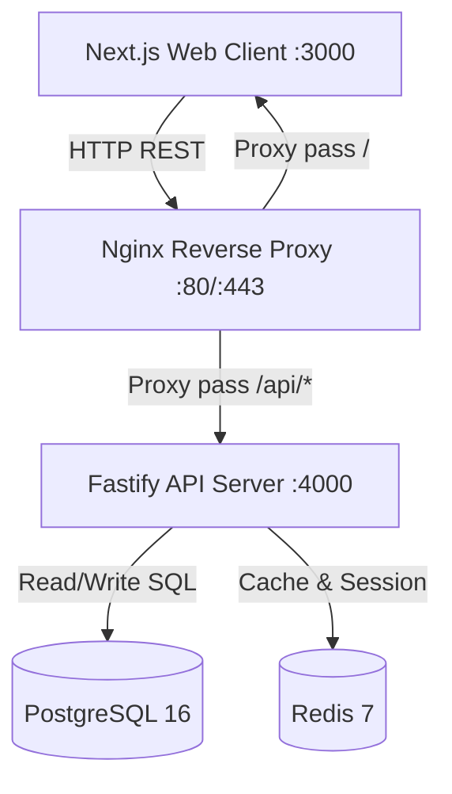
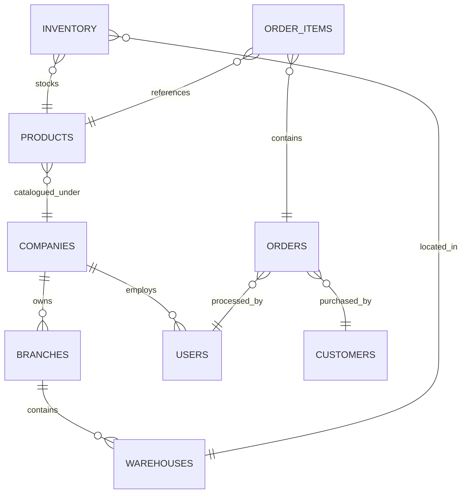

# Architecture Guide — Enterprise POS System

This guide outlines the system design, communication protocols, state management, security boundaries, and data architectures of the monorepo application.

---

## System Overview

The Enterprise POS System is built as a split-architecture monorepo separating a stateless, RESTful API backend server from a server-side rendered (SSR) frontend user portal.



---

## Monorepo Division

The codebase is unified using `pnpm` workspaces and `Turborepo` to orchestrate build pipelines, cached execution, and cross-package references.

```
Enterprise-POS-System/
├── apps/
│   ├── api/                  # Node.js API Service (Fastify 5)
│   └── web/                  # Next.js 16 Client Portal
└── packages/                 # Shared types, lint configs (if applicable)
```

---

## Frontend Architecture

The client application runs on **Next.js 16** with React 19.

- **Page Routing:** Managed server-side and client-side using the Next.js App Router directory structure.
- **State Management:**
  - _Server State:_ Fetched, cached, and updated using **TanStack Query**.
  - _Client state:_ Global stores (such as UI collapse toggles, POS cart items, active cashier sessions) are held in **Zustand** stores.
- **API Client Layer:** Components never request endpoints directly. Instead, they interact via unified custom react hooks that query domain-specific `ApiClient` service instances (under `src/services/*`) initialized with configured axios intercepts.

---

## Backend Architecture

The backend API server is built on **Fastify 5** for top-tier HTTP parsing throughput and minimal execution overhead.

- **Structure:** Modules are separated into controller, service, validator, and schema definitions.
- **Database Interface:** Object relation mapping is driven by **Prisma 6**, compiling schemas into type-safe client APIs.
- **Input Validation:** Powered by Zod schemas, checking request headers, parameters, and bodies at the middleware stage.

---

## Database Architecture

A relational **PostgreSQL 16** database manages core transactional records, product catalogs, branch logs, and audit histories.

### Key Data Relations



---

## Authentication & Authorization Flow

The application implements a stateless JSON Web Token (JWT) workflow with a stateful session blacklist cache inside Redis:

1.  **Credentials Submission:** Client posts credentials to `/auth/login`.
2.  **Tokens Issuance:** Backend returns:
    - An `accessToken` (in-memory only, short-lived: 15 minutes).
    - A `refreshToken` sent as a secure, `httpOnly`, `sameSite: strict` cookie (long-lived: 7 days).
3.  **Authentication Guarding:** Every request places the access token inside the `Authorization: Bearer <token>` header. If the token expires (yielding a `401 Unauthorized`), the Axios response interceptor pauses active requests, requests a refresh token exchange at `/auth/refresh`, and retries the original request.
4.  **Multi-Tab Session Sync:** The frontend employs a `BroadcastChannel` instance to broadcast logout events across all open browser tabs, securing sessions instantly upon user termination or idle timeouts (15 minutes of inactivity).
5.  **Role-Based Access Control (RBAC):** Users hold specific roles (`admin`, `manager`, `cashier`) and permission arrays. Client-side rendering is gated by the `<PermissionGuard>` component, checking roles and permissions against the active Zustand store.

---

## Caching Strategy (Redis 7)

Redis is deployed for:

- **JWT Revocation Lists:** Storing blacklisted tokens on user logouts until expiration.
- **Rate Limiting:** Guarding sensitive endpoints from brute force and denial of service.
- **Session Management:** Caching active session metadata for immediate validity checks.
